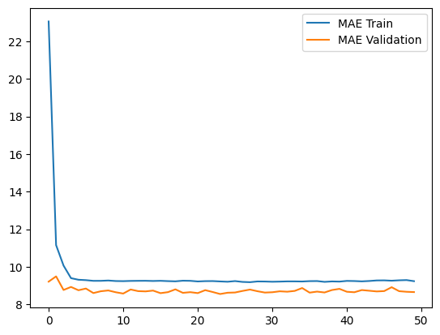

# Proyek Analisis Data

# Setup environment
_pakai virtual environment untuk menghindari package bentrok_

### Linux (Turunan Debian)
```
cd Proyek_Analysis-Data-E-Commerce
python3 -m pip install virtualenv
python3 -m venv virtvenv
source virtenv/bin/activate
python3 -m pip install -r requirements.txt
```

### Windows (Powershell)
```
cd Proyek_Analysis-Data-E-Commerce
python -m pip install virtualenv
python -m venv virtvenv
.\virtvenv\Scripts\Activate.ps1
python -m pip install -r requirements.txt
```

## Run steamlit app

### Linux
```
python3 -m streamlit run main.py
```
### Windows (Powershell)
```
python -m streamlit run main.py
```


# Deskripsi Proyek
Proyek ini bertujuan untuk menganalisis dan memprediksi dua aspek penting dalam e-commerce, yaitu:
1. **Prediksi Harga**: Menggunakan atribut seperti dimensi produk dan berat untuk memprediksi harga.
2. **Prediksi Waktu Pengiriman**: Memanfaatkan jarak pelanggan-penjual, berat produk, dan biaya pengiriman untuk memprediksi waktu pengiriman.

Model yang digunakan dalam proyek ini meliputi:
- **Deep Learning**: Model jaringan saraf tiruan sederhana.
- **XGBoost**: Model berbasis gradient boosting.

## Dataset
Dataset yang digunakan memiliki atribut-atribut berikut:
- `seller_customer_distance_km`: Jarak antara penjual dan pelanggan (dalam kilometer).
- `price`: Harga produk.
- `freight_value`: Biaya pengiriman.
- `product_weight_g`: Berat produk (dalam gram).
- `product_length_cm`: Panjang produk (dalam cm).
- `product_height_cm`: Tinggi produk (dalam cm).
- `product_width_cm`: Lebar produk (dalam cm).
- `order_estimated_delivery_day`: Waktu estimasi pengiriman (dalam hari).

## Implementasi
1. **Preprocessing Data**:
   - Data dibersihkan dan diolah untuk memastikan kualitasnya.
   - Relasi antar atribut divisualisasikan untuk memahami hubungan antar variabel.

2. **Modeling**:
   - Model Deep Learning dan XGBoost dikembangkan untuk kedua jenis prediksi.
   - Data dibagi menjadi data latih, validasi, dan uji.

3. **Evaluasi Model**:
   - Mean Absolute Error (MAE) digunakan sebagai metrik evaluasi utama.

## Visualisasi Relasi Dataset


## Hasil Evaluasi
Tabel berikut menyajikan hasil evaluasi model berdasarkan MAE:

| Model             | Prediksi Harga (MAE) | Prediksi Waktu Pengiriman (MAE) |
|-------------------|----------------------|---------------------------------|
| Deep Learning     | 76.33               | 9.00                            |
| XGBoost           | 45.32               | 109.37                            |

## Visualisasi Hasil
### Prediksi Harga
- **Deep Learning**


- **XGBoost**


### Prediksi Lama Pengiriman
- **Deep Learning**


- **XGBoost**


## Struktur Proyek
```
Proyek_Analysis-Data-E-Commerce/
├── data
│   ├── customers_dataset.csv
│   ├── fix
│   │   ├── city_encoder.npy
│   │   ├── delivery_prediction.npz
│   │   ├── detailed_orders_dataset.csv
│   │   ├── order_status_encoder.npy
│   │   ├── payment_type_encoder.npy
│   │   ├── price_prediction.npz
│   │   ├── product_category_name_encoder.npy
│   │   └── state_encoder.npy
│   ├── geolocation_dataset.csv
│   ├── order_items_dataset.csv
│   ├── order_payments_dataset.csv
│   ├── order_reviews_dataset.csv
│   ├── orders_dataset.csv
│   ├── product_category_name_translation.csv
│   ├── products_dataset.csv
│   └── sellers_dataset.csv
├── data_prep.ipynb
├── main.py
├── model
│   ├── dl_model_delivery_prediction.h5
│   ├── dl_model_price_prediction.h5
│   ├── xgboost_model_delivery_prediction.json
│   └── xgboost_model_price_prediction.json
├── modeling.ipynb
├── packages.txt
├── pages
│   └── predict.py
├── README.md
├── requirements.txt
└── url.txt
```

Proyek ini memberikan wawasan penting untuk meningkatkan efisiensi dan prediksi dalam e-commerce.

